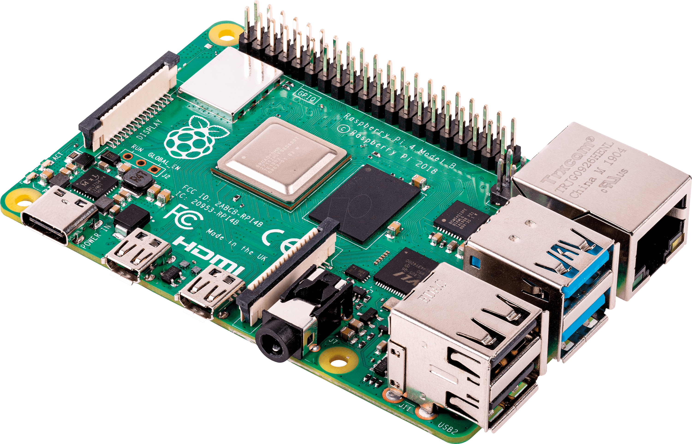

# LEDdisplay


Ce cours a pour but de vous faire brièvement découvrir les outils qui vous seront utiles dans vos projets de programmation puis de les utiliser dans le cadre d'une matrice de LED.


## Outils de programmation

Voici la liste des outils que j'utilise pour mes projets de programmation :

* [Git](https://git-scm.com/) et [Github](https://github.com/) : Git est un outil de gestion de version alors que  github est une plateforme en ligne qui permet, entre autre, d'héberger  des dépôts Git.


* [GitHub Desktop](https://desktop.github.com/) : GitHub Desktop est une application qui vous permet d'interagir avec GitHub en utilisant une interface graphique au lieu de la ligne de commande ou d'un navigateur web.

* [Visual studio code](https://code.visualstudio.com/download) : Visual Studio Code est un éditeur de code extensible développé par Microsoft pour Windows, Linux et macOS. Les fonctionnalités incluent la prise en charge du débogage, la mise en évidence de la syntaxe, la complétion intelligente du code, les snippets, la refactorisation du code et Git intégré.


* [Live Share](https://visualstudio.microsoft.com/fr/services/live-share/) : Visual Studio Live Share vous permet de modifier et déboguer tout code en collaborant en temps réel avec d'autres personnes.

Pour mieux comprendre le fonctionnement de git et github je conseille vivement de regarder la [playlist](https://www.youtube.com/watch?v=BCQHnlnPusY&list=PLRqwX-V7Uu6ZF9C0YMKuns9sLDzK6zoiV) de [The Coding Train](https://www.youtube.com/channel/UCvjgXvBlbQiydffZU7m1_aw).

## Contribution

Pour ce premier cours, Il sera plus simple de simplement poster vos fichiers python directement depuis github web.

Les Pull requests sont les bienvenues dans le dossier :  __"1-Cours_List"__

## Fonctionnement de la matrice de LED

La matrice de led est faite à partir d'un bandeau de led ws2811 incrusté dans une plaque de bois fait avec la découpeuse laser.

Ce bandeau est branché à une alimentation ainsi qu'à un controlleur dans notre cas un __raspberry pi 3__ (Mais nous aurions aussi pu utiliser un __Arduino__).

## Raspberry pi

Un [Raspberry Pi](https://www.raspberrypi.org/) est avant tout un ordinateur de taille est de coût réduit. Il permet de faire quasiment la même chose qu'un ordinateur de bureau. Son prix réduit et sa consommation énergétique 50 fois inférieure à un PC fixe standard en font un candidat idéal pour de nombreux projets.



Afin d'avoir une interface graphique, le system d'exploitation [Raspberry Pi OS](https://fr.wikipedia.org/wiki/Raspberry_Pi_OS) est installé sur le raspberry pi. Ce système d’exploitation GNU/Linux est spécialement conçu et optimisé pour raspberry pi.

## Programmation

Pour controller notre bandeau de led nous utilisons Python et les bibliothèques [neopixel](https://pypi.org/project/adafruit-circuitpython-neopixel/) et [board](https://pypi.org/project/board/)

Pour installer ces bibliothèques nous utilisons le package manager [pip](https://pip.pypa.io/en/stable/).

```bash
pip install adafruit-circuitpython-neopixel
```

Nous pouvons maintenant importer ces bibliothèques dans notre code :

```python
import neopixel
from board import *
```
